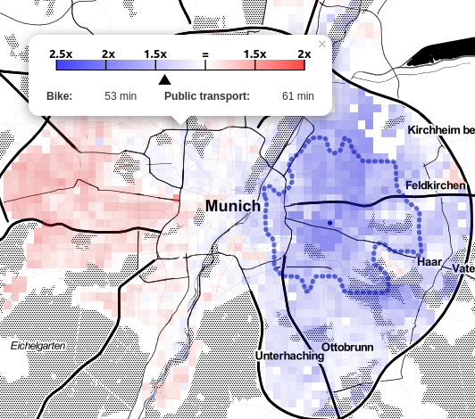
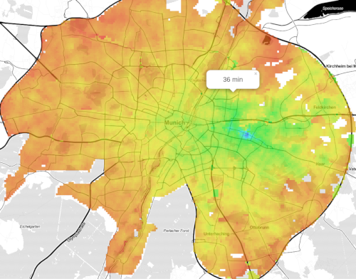
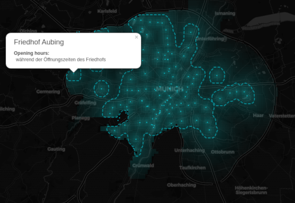

# HeatMaPy

Check [my other projects](https://gitlab.com/rgcalsaverini/index) here!

A (rather incomplete and alpha) library to render custom map visualizations.
Specifically heat-map-like ones.

It is pretty much a convenience wrapper around Folium with some extra utilities.

## License

You are free to use and modify this code to do whatever you please, just please give credit :) 

## How to use

To install, just add the dependencies on the `requirements.txt` file:

```shell script
pip install -r requirements.txt
```

The visualization has 2 parts:
- A renderer, which is responsible for generating the visual representation of the map.
currently the only one implemented is the FoliumRenderer, which generates an interactive HTML map.
This can be easily extended to generate other types of representations, such as static images.
- The heatmap itself, which controls the flow

Another important part is the getter callback, which is responsible for generating
the actual numerical data that will be used on the heatmap.

## Minimal example

The code bellow will generate a simple heatmap showing the linear distance from each point
in Munich against Marienplatz, and save it to linear_distance.html.

```python
import json
from geopy.distance import distance
from heatmap import HeatMap, DefaultRenderer

origin = (48.1373629, 11.5748808)

with open('./geo/muenchen.json', 'r') as fp:
    geo_json = json.load(fp)


    def get_lin_dist(c1, c2):
        return distance().measure(c1, c2)

    renderer = DefaultRenderer(center=origin, zoom=12)
    h_map = HeatMap(origin, geo_json, square_size=500, filename='linear_distance')
    h_map.generate(get_lin_dist)
    h_map.normalize()
    h_map.render(renderer)

```

## The map from [this reddit post](https://www.reddit.com/r/dataisbeautiful/comments/igwvxj/oc_ive_made_a_heatmap_of_the_travel_times_from/)

[Live demo](http://chupsy.calsaverini.com/heatmapy-demos/bike.html)

On that post I've generated a map that displays a comparison between the time it takes to
get from my house to any point in Munich by bike or by public transportation.

An adapted version of that code is on [bike_example.py](./bike_example.py). It is not exactly the
one I used there, as that was a mess.




## Travel time by public transport
[Live demo](http://chupsy.calsaverini.com/heatmapy-demos/mvg.html)

Heatmap of travel time from my house to anywhere on the city by public transport.

Check out [mvg_example.py](./mvg_example.py).




## A (Somewhat) more complete example

[Live demo](http://chupsy.calsaverini.com/heatmapy-demos/toilet.html)

This is a map featuring public toilets on Munich. It showcase some of the features:
- Changed texture of map (dark map)
- Markers (on this case showing each public toilet)
- Region polygons (1km area from public toilets)
- Custom color scale

Check [complete_example.py](./complete_example.py).



